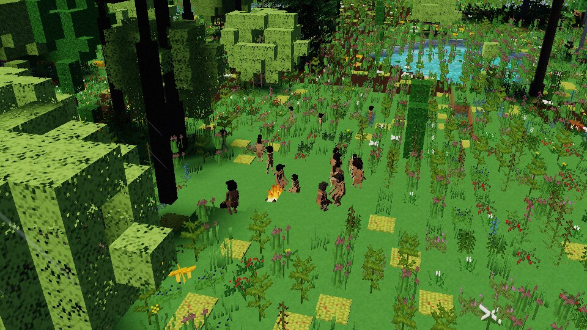
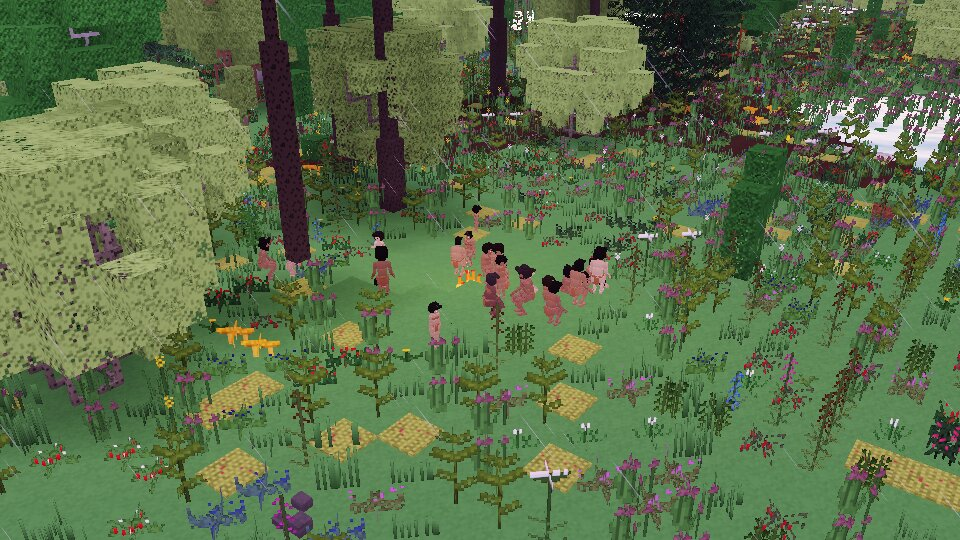

# Era review: the Lower Paleolithic (H8)

*Four hundred thousand years ago: *Homo erectus* across the Old World's lands, with fire, the hand
axe and the wooden spear. A world of the era on the Standard planet of seed 3, its deep past run,
a century of its households lived, a life born into one of them and a week of its band watched.*

*A band of *H. erectus* about its fire in a glade by a lake (latitude 50°, early summer, 15 h):
no beds — they know none — but the fire kept, the grown sitting and the young about them.*

*The same camp at dusk, the band drawn in to the fire in the rain.*

## How it was run

As for the other eras (`docs/review/era-middle-paleolithic.md`): the shots of
`tools/shots/h8_eras.shots` on the cloud machine's software device; the sample week of
`crates/hearth/tests/era_week.rs` (`ERA=lower`, to `bench-out/h8/lower_paleolithic_week.md`), the
test's player following its band; `hearth history` on the Standard planet and on one of Earth's
size; `hearth_people/tests/demography.rs` for the life table. This band camps on a lake with
little moving water about it, and the week ran its seven days.

## The world

Deep time on the Standard planet ends with **409 *H. erectus*** in 137 cells, one people (308 in
the Afrotropical, 100 in the Palearctic, one on an island of the Oceanian); on a planet of Earth's
size, 4.77 million in 1,421 peoples. The chronicle: *erectus* appears in the cradle 1.9 million
years ago and walks out of it into the Palearctic at once, as the record's Dmanisi has it; crosses
a narrow sea to an island 1.875 million years ago (within reach, as Flores was); comes to the hand
axe at 1.76 million, fire keeping and tracking at a million, roasting at 780,000, the windbreak
and the wooden spear at 400,000 — the record's dates (Acheulean, Wonderwerk and Gesher Benot
Ya'aqov, Schöningen). Its census rises from some 250 to 450 over the last half-million years, the
sea between −60 m and the present's as the ice comes and goes. **Dispersal on the planet's
geography is plausible**, with two things against the record: the people reach the planet's
far-south realm (the "Antarctic") in a warm spell 965,000 years ago and leave it 20,000 years
later on the Standard planet, and on Earth's size 2,671 of them still live there at the end —
deep time asks whether a people can winter in a cell, and a cold-tolerant hunter with fire on the
far south's warmest coast can; and 4.77 million is more than the record's guesses for *erectus*
(a few hundred thousand to a million), the density (D198) being the table's whole range at its
best rather than its mean.

## The checklist (V2.1 §15.5)

**Group sizes.** The week's band is 19 *H. erectus* (9 grown, 9 juvenile, 1 young), the era's 15–40;
it held together all week, never out of the player's sight, and went a kilometre about its camp. The
screenshots' band about 20.

**Daily routines.** Asleep from 21 to 06 by the place's own hour, no one asleep at midday; feeding
through the morning (427 people-half-hours 06–12), resting through the middle of the day (435 at
12–15), company at the fire in the evening (143 grooming at 18–21), the young carried (126
people-half-hours in each daylight block) and at play all day. On the cold, wet mornings the
children went out to feed, chilled, and came back to sit at the fire, again and again (D205, D207).

**Work and division of labour.** *No work was done in the week*: the only tasks were feeding (362
people-half-hours by boys and girls, 362 by men and women) and drinking. The culture's labour shares
are drawn (women's share: hunting 0 %, butchery 10 %, knapping 42 %, firemaking 70 %, gathering 50
%, childcare 95 %), gender roles from culture data only, but as in the other eras there is little
work for them to fall on until hunting, gathering and making are lived in full.

**Tools only from known nodes.** Every work is guarded by a debug assertion (H6) and none fired.
The grown know the Lower Paleolithic's: the hand axe, the chopper, sharp flakes and cutting with
them, the hammer and anvil, cracking nuts, butchery and marrow, the digging stick, the carrying
bundle, throwing stones, tracking, keeping fire, roasting, the windbreak and the wooden spear. The
first week found them knowing the bow drill, basketry, thatching, stone boiling and ochre as well,
found out for themselves in the recent past: since D206 a person finds out for itself only what
its era could.

**Food and diet.** Fruit and nuts where trees bear, grubs and seeds of the ground, and (D202) the
day's take — meat, roasted, and roots — at camp of an evening.

**Settlements and architecture.** A kept fire, burning at the week's end; no beds, since they know
none to make (they sleep on grass and leaves pulled together, as apes nest: LYING_CLO, D202). They
know the windbreak; its lee stands for it at the camp (D202, D207), but none is raised until
H11's shelters.

**Dress.** None: they know none, and none is drawn.

**Ritual and belief.** This band lays its dead out (`LaidOut`), greets with a call. No one of the
band died in the week but in the player's keeping: the test's player died of thirst 6.5 days in and
lived on as Bawi, the band's elder, who died 0.4 days later as the test kept her (below); the grown
woman inspected mourns her mother Bawi, and the man the son who was the player.

**Strangers.** None met in the week.

**Conflict.** No quarrel, no gossip of anyone in the week.

**Demography against the life tables.** *H. erectus*'s own table (D198): the two-century test gives
a life expectancy at birth of 20.3, 5.43 children to a woman who lives to 45, 3.65 years between
births (weaning sooner than ours), few past sixty, and three generations and more. Bawi, at 52 the
band's elder, had borne nine, five of them dead — the table's childhood.

**Variety.** The two inspected differ as their records do: a woman of 30, with child, who has lost
two of her four; a man of 40 who has lost a son. Temperaments, ties and opinions differ person to
person. It reads as ordinary, quiet life — quieter than the other eras, the band saying nothing at
all (below).

## What was said

*Nothing was said in the week.* The people's proto-language (D186's generator, H8) has ten sounds,
subject–verb–object, and a handful of words — *water ba, fire a, mother bi, child ta, hello a'iya* —
and its speakers use it seldom: what they say is mostly gossip, offers and thanks, and this week
gave them no occasion. The first week, in which four children died, was heard as 5,695 lines of four
kinds: the band's gossip, which in a proto-language comes out as a bare name ("I", 5,477 times;
"Bawi", 216), and "bai" (this), holding something out, and "ii" (thanks).

## Issues

1. **The first week's four children died of cold** the first morning (latitude 42.7°, 6 °C, drizzle,
   a wind of 6 m/s, unclothed): fixed by the chilled going to the fire (D205) and the camp's lee and
   the holding of children by day as at night (D207). Since then the band has lost no one in two
   days and seven.
2. **The test's player died of thirst 6.5 days in**, and again as Bawi 0.4 days later: the test
   fetches water within 400 m every six hours, and on this lake shore its search did not always
   find it. The week went on with the player living on as one of the grown (D200) and the band
   watched to its end. A test's player, not a person of the band.
3. **No work and no talk in the week** (above).
4. **Deep time's far south and its numbers** (above): *erectus* in the planet's far-south realm,
   more of them than the record's guesses.
5. **Shelters**: they know the windbreak; the camp's lee stands for it, but none is raised until
   H11.
6. The screenshots' run and the week's run were born at different places (latitude 50° and 42.7°)
   from the same seed: the recent past is not yet deterministic across runs.
