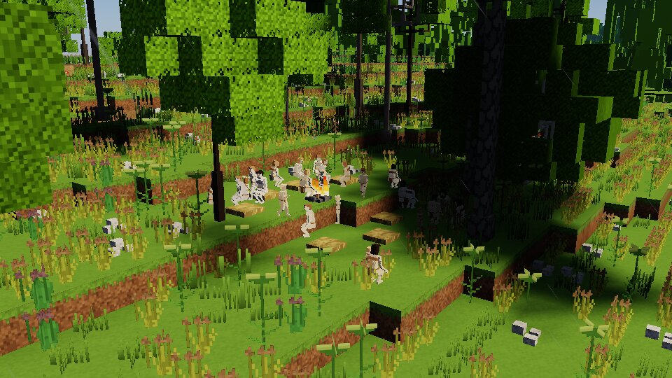
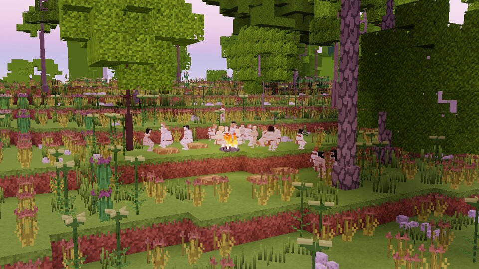

# Era review: the Middle Paleolithic (H8)

*Forty-five thousand years ago: Neanderthals in the north, our kind spreading out of its cradle in
the south. A world of the era on the Standard planet of seed 3, its deep past run, a century of
its households lived, a life born into one of them and two days of its band watched.*

*A Neanderthal band of 25 at its fire on its summer upland camp, beds of grass about it
(latitude 17°, 33 °C).*

*The same camp at dusk, the sun three degrees down: the band gathered at the fire.*

## How it was run

- **Screenshots**: `hearth --screenshot-list tools/shots/h8_eras.shots` — the era's world, the
  recent past lived about the spawn, a life born into a household, the bands about it lived 40 s
  and their camps laid as the game keeps them. Rendered on the cloud machine's software device
  (llvmpipe): looks only, no frame rates.
- **A sample week**: `cargo test -p hearth --test era_week -- --ignored` (`ERA=middle DAYS=2`)
  logs `bench-out/h8/middle_paleolithic_week.md`: who is about and what they do by the local hour,
  who works at what, what is said, the camp, who left the band and how, and the inspector's record
  of a grown woman and a grown man. The test's player follows its band. **Two days, not seven**:
  this band camps by water and the finite water simulation about the player (`water_table` under
  `WorldWater::ground`, every tick) runs a debug build at about a sixth of the speed, a week some
  three hours; the Lower Paleolithic week, its camp on a still lake, ran all seven days.
- **Deep time**: `hearth history --seed 3 --era middle_paleolithic --size standard`, and
  `--size earth` for the dispersal on a planet of Earth's size.
- **Demography**: `hearth_people/tests/demography.rs` (`the_archaic_peoples_live_and_die_by_their_tables`).

## The world

On the Standard planet (65 km round, peoples 26.6 times as dense as real, D196/D198) deep time ends
with **138 Neanderthals** in 90 cells, two peoples, 133 of them in the Palearctic, and **434 of our
kind**, 388 in the Afrotropical cradle and 34 in the Palearctic. On a planet of Earth's size the
same seed gives 1.54 million Neanderthals (all but 11,000 in the Palearctic) and 4.58 million of
our kind, 4.25 million still in the cradle and 253,000 in the Palearctic: the Neanderthals hold the
north against our kind until the Upper Paleolithic's techniques come (D191), as they did. *H.
erectus* is gone from both realms by 285,000 years ago, crowded out by the Neanderthals in the
north and our kind in the south. **Dispersal on the planet's geography is plausible**: from the
cradle over land and along coasts, the Neanderthals out of the Palearctic's *erectus*, the sea
crossed only within reach. Two things run against the record: on the Standard planet a history
cell spans some 11° of latitude, so a people's range runs through climates in a few cells and its
gene pool is mixed across them (the screenshot's Neanderthals at 17° are pale, their people's pool
mostly of the north); and the Neanderthals live in the tropics on both planets (the sample week's
band at the equator), where the record has none — deep time asks only whether a people can winter
somewhere, not whether a better-adapted people holds it.

## The checklist (V2.1 §15.5)

**Group sizes.** The week's band is 21 Neanderthals (12 grown, 7 juvenile, 2 young), the era's
10–30; the screenshots' bands 25. Bands split past 35 (the table's `band_splits_at`).

**Daily routines.** Asleep from 21 to 06 by the place's own hour; feeding in the early morning
(60 people-half-hours 06–09), resting through the heat of the day (150 at 12–15), company at the
fire in the evening (71 grooming at 18–21), the young carried and at play throughout. This is the
Neanderthal day as the data has it (`neanderthal_day`), and it shows.

**Work and division of labour.** *No work was done in the two days*: nobody knapped, worked hide
or made anything; the only tasks were feeding and drinking (feeding mostly by men, 69 of 96). The
people make things only when they need them (H5–H6) and a band met with its tools has no need in
two days. The culture's labour shares are drawn (women's share: hideworking 90 %, gathering 90 %,
cooking 95 %, knapping 50 %, hunting 40 %) but have little to act on until hunting and gathering
are lived in full.

**Tools only from known nodes.** Every work is guarded by a debug assertion (H6) and none fired.
What they know is the Middle Paleolithic's: prepared cores, hafting, scrapers, hide scraping,
birch tar, the hand drill, ochre, the lean-to and windbreak. Their grown keep as stories (legends)
blades, the burin, bone and antler, the eyed needle, netting and snares — techniques their band
held and lost in the recent past (D188), learned from neighbours who knew them; with D206 a band
no longer finds out for itself what its era did not know, but what passed between peoples in the
recent past before it is kept. *Blades and the needle in a Neanderthal band 45,000 years ago are
too early.*

**Food and diet.** Fruit and nuts where trees bear (H2's food), grubs and seeds of the ground, and
since D202 the day's take — meat (roasted, as they know how) and roots — eaten at camp in the
evening by the hungry, standing for the hunting and gathering the full tier does not yet live.

**Settlements and architecture.** A kept fire, burning at the week's end, and six beds of grass
about it; in the screenshots seven beds about the fire. No shelters: the people raise none until
H11's villages, though they know the windbreak and the lean-to.

**Dress.** Drawn bare. Since D202 they wear, against the cold, what they know (hide capes where
they know hide wraps), but nothing is drawn; at the equator they wear nothing.

**Ritual and belief.** This culture buries its dead (`Buried`; the Neanderthal generator's
burials, Rendu et al. 2014), greets with an embrace. No death in the band in the two days but the
player's: its mourning is in the inspector's records (`mourned #3516`).

**Strangers.** None met in two days.

**Conflict.** No quarrel in the two days.

**Demography against the life tables.** The test of two centuries on the Neanderthals' own table:
a life expectancy at birth of 21.6 (the table's 20), 49 % alive at fifteen, 14 % of those to
sixty, 5.85 children to a woman who lives to 45, 3.25 years between births (weaning at 1.4,
Scladina); three generations and more. Their numbers in the test's country fall from 126 to 47
over the two centuries, toward what their table's density (0.025 a km²) feeds; in the era's world
deep time sets the density (D198).

**Variety.** The two inspected are as different as their records: a woman of 56 who has outlived
her son, a man of 52 with grandsons; temperaments, ties and knowledge differ person to person. The
day reads as ordinary life; little in it reads as scripted, but little happens.

## What was said

Five lines in two days, made out not at all — *the player had died and lived on as another*
(below), and the lines were heard in a tongue its new person does not share the words of:
"wgi i" (water there?), pointing; "yi bami a", showing. A Neanderthal language of fifteen sounds,
subject–object–verb, fourteen sound changes from its root: *water wgi, fire wa, mother i, child
hiwu, hello uwa, good ri*.

## Issues

1. **The test's player died of heat stroke 0.4 days in** — a grown sixteen-year-old standing
   about in the equator's sun without drinking (the test fetches water every six hours). The week
   went on with the player living on as one of the band's grown (life after death, D200), so the
   band was watched to its end. A life is born dressed only in a cold country (no parka at the
   equator); a born player in the heat must drink and keep to the shade as anyone must.
2. **Neanderthals at the equator** (above): deep time has no reason to keep them out.
3. **The finite water simulation's cost** about a camp by water (above), a debug build's; the
   gate is on the PC.
4. **No work in two days** (above).
5. **Anachronistic legends** (above).
6. The birth place differed between runs of the same seed (latitude 2.8° once, −0.2° twice): the
   recent past is not yet deterministic across runs.
