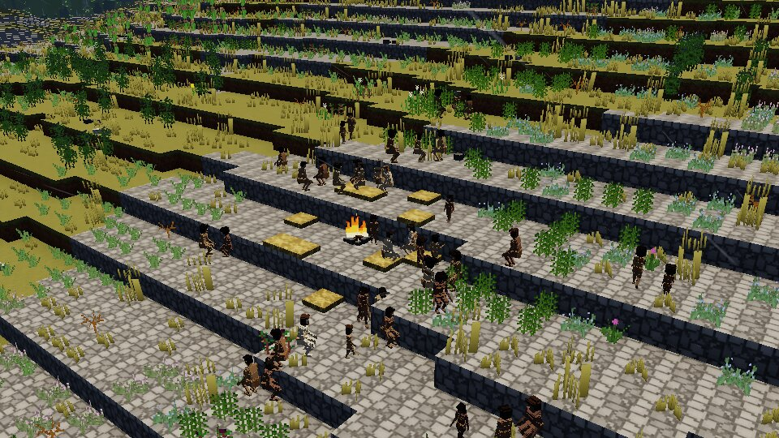
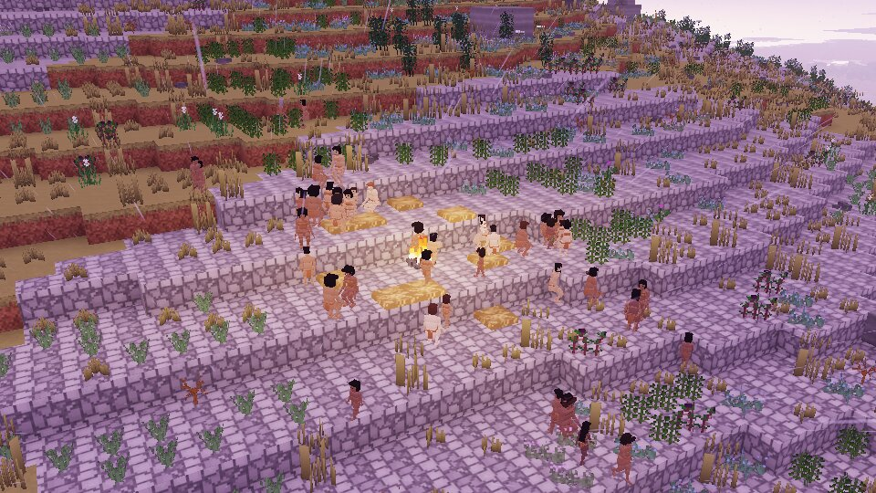

# Era review: the Upper Paleolithic (H8)

*Twenty-five thousand years ago, nearing the Last Glacial Maximum: our kind across the world in
bands of a few families, linked into peoples that gather each autumn. A world of the era on the
Standard planet of seed 3, its deep past run, a century of its households lived, a life born into
one of them and two days of its band watched.*

*A band of 49 at its summer upland camp, its fire and ten beds (latitude 24°, 35 °C).*

*The same camp at dusk, the sun three degrees down.*

## How it was run

As for the other eras (`docs/review/era-middle-paleolithic.md`): the shots of
`tools/shots/h8_eras.shots` on the cloud machine's software device; the sample week of
`crates/hearth/tests/era_week.rs` (`ERA=upper DAYS=2`, to `bench-out/h8/upper_paleolithic_week.md`),
the test's player following its band; `hearth history` on the Standard planet and on one of
Earth's size. Two days rather than seven: since D204 the band camps by water, and the finite water
simulation about it slows a debug build to a sixth (a seven-day run passed two hours).

## The world

Deep time on the Standard planet ends with **1,221 of our kind** in 213 cells, one people (856 in
the Afrotropical, 321 in the Palearctic, a few in the south and on islands); on a planet of
Earth's size, 10.1 million in 2,036 peoples. The chronicle has our kind appear in the cradle
300,000 years ago, crowd *H. erectus* out of the south by 290,000 and the north by 186,000, and
come to its techniques at the record's dates: prepared cores 138,000, pitch adhesive 70,000,
blades, cordage and the hand drill 50,000, rafts 49,500, cave painting 45,000, the bow drill, the
burin and the fat lamp 40,000, bone and antler 39,500, the harpoon 39,000, the eyed needle 37,500
and sewn clothing 35,000. **Dispersal on the planet's geography is plausible** — out of the cradle
over land, the islands reached by raft once there are rafts — with one difference from the record:
this era's deep time runs only our kind and its forebears, so with no Neanderthals in it our kind
reaches the Palearctic at once (in the Middle Paleolithic's deep time, which has them, it is held
in the south until its techniques come). The sea at −94 m 29,500 years ago opens land bridges.

## The checklist (V2.1 §15.5)

**Group sizes.** The week's band is 36 (18 grown, 18 young and half-grown), the era's 25–50;
the screenshots' 49. Peoples of about 1,500 (D193).

**Daily routines.** The forager's day of the data (`forager_day`): asleep from 21 to 06; feeding
and drinking in the early morning, resting through midday (253 people-half-hours at 12–15),
company at the fire in the evening (182 grooming at 18–21), the young at play all day.

**Work and division of labour.** *No work was done in two days*: the tasks were feeding,
drinking and, twice, sharing food. The culture draws its labour from Murdock and Provost's
cross-cultural ratings (women's share: sewing 95 %, gathering 95 %, cooking 70 %, hideworking 40 %,
knapping 30 %, hunting 0 %) — gender roles from culture data only — but there is little work for
them to fall on until the people hunt, gather and make things in full.

**Tools only from known nodes.** No work in the week, and the debug assertion guards every work.
What they know is the Upper Paleolithic's: blades, the burin, bone and antler, the eyed needle,
sewn clothing, netting, the harpoon, the fat lamp, the bow drill, drying and smoking, fur bedding,
and the bow and the fishhook (both at the edge of the record for 25,000 years ago). Since D206 a
person finds out for itself only what its era could.

**Food and diet.** As in the other eras (D202): trees' fruit and nuts, ground food, and the day's
take — roasted meat and roots — at camp of an evening. This culture forbids raw fish (a taboo
drawn from its generator's, after the Tasmanians and the Hadza).

**Settlements and architecture.** A kept fire burning at the week's end and ten beds about it
(furs, where they know fur bedding). No shelters until H11.

**Dress.** Drawn bare; against the cold they wear what they know — at this latitude sewn parkas,
leggings and moccasins below 16 °C (D202) — but none of it is drawn.

**Ritual and belief.** This band lays its dead out (`LaidOut`), greets with a call. No death in
the two days. The evening's stories (H6) pass on places and techniques: "they make thing",
showing.

**Strangers.** None met in two days. No gathering in the two days (it is the autumn's, and a band
lived in full gathers only within a short walk, D203).

**Conflict.** No quarrel; but the band talks of two of its own as stingy ("Faa not share",
720 times; "Gushuzi not share", 307) and of one as good — gossip (H4) passing a name for
generosity, as foragers' talk does; a sanction of mockery may follow.

**Demography against the life tables.** Our kind's table (H3's foragers): the two-century test
gives a life expectancy at birth of 30.5, 57 % alive at fifteen, 43 % of those to sixty, 4.3
children to a woman who lives to 45, four years between births (`demography.rs`). The week's
band holds three generations: elders of 67 and 68 with grandchildren.

**Variety.** Nine things said, by many voices; elders, adults and children each about their own
business; values, ties and opinions differ person to person ("thinks: Person(3977) generous
+0.60"). It does not look scripted; it looks quiet.

## What was said

1,263 lines heard in two days, nine different, all made out (the player's mother tongue):
gossip (above), "khòi ngòr" (water there), pointing; "guu ngòr ngòmga" (food there many),
pointing; "u hi" (eat this), holding something out, and "rihòtu" (thanks); "nigò fa da" (stay we
here) in council. A language of nineteen sounds, verb–subject–object, its words its people's.

## Issues

1. **The first full week killed ten of a band of 31 by heat stroke and two children by thirst**:
   its camp was on a dry upland with no water it knew, and the fires warmed the people in the
   heat. Fixed (D204: camps by water, the fire only in the cool); the two days since lost none.
   Before that, a band coming into full walked day and night toward a camp three kilometres off
   over terraced slopes it could not cross (D203), and the bands of a people stood all summer at
   a gathering meant to last twenty days of the real year (D201).
2. **No work in the sample** (above), nor a gathering seen in full.
3. **The finite water simulation's cost** about a camp by water, in a debug build (above).
4. **Dress not drawn; no shelters** (above).
