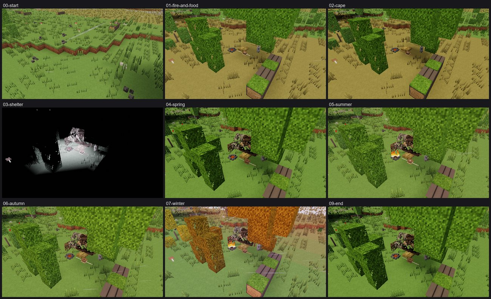

# Vertical slice review 1 (V2-9)

*A year in the temperate forest from a loincloth in spring, played by a scripted bot.*

## How it was run

- `scripts/slice-year.sh` runs `crates/hearth/tests/slice_year.rs`: seed 7, the test planet
  (eight-day seasons, a 32-day year), knowledge by discovery only, a camp under birches near
  the first spawn (latitude 40° S). The bot is the V2-5 acceptance's (`crates/hearth/tests/bot/`):
  it gets fire from a lightning-struck tree, stone tools, butchery and hides by discovering each
  technique, and a hide cape; then, before the cold, it piles brush (learning the windbreak),
  comes to the lean-to, and puts one up over its bed; then it lives day by day: water, food (a
  roe deer dies near the camp every day — the bot does not hunt), the fire, firewood,
  sleep.
- Every day goes to `bench-out/slice/year.log`; copies of the world at its moments to
  `bench-out/slice/<moment>/`, rendered with the new `--screenshot save=<dir>` (the world as its
  player left it: the date and hour, the changes, the things lying about).
- The year was run again after each round of fixes; each run's failure is the next issue below.

## The year

*The year's moments (`bench-out/slice-sheet.png`, rendered from the kept saves): the start;
fire, food and a bed; the hide cape; the lean-to; then the seasons round to spring.*

The last run, with every fix below in, lived the year through:

| Day | Season | What |
|----:|--------|------|
| 0 | spring | a loincloth, under birches by a stream |
| 0.2 | | fire carried from a lightning-struck tree |
| 1.0 | | the first kill hacked at with a flake, cooked and eaten |
| 4.4 | | butchery known (from hacking at carcasses) |
| 6.0 | | stone tools, hafting, a bed by the fire |
| 10.2 | summer | a hide cape, worn |
| 11.1 | | the windbreak known from piling brush, and from it the lean-to |
| 12.5 | | a lean-to of posts, a beam and boughs over the bed |
| 16 | autumn | kills cooked a day's worth at a time; meat keeps in the cool |
| 24 | winter | nights down to 3 °C |
| 28.8 | | the worst night: the core at 32.3 °C before the fire was built up again |
| 32.1 | spring | alive, sheltered, 23 techniques known |

Twenty-one roe deer (712 cuts, 611 cooked; the rest went off in the summer heat). The core went
below 35 °C on eight nights, each with the fire burned low, and the fire warmed it again. Rain
reached the bed through the lean-to and the birches twenty times. The stream by the camp dried
up in the summer drought (the climate is summer-dry), and water was 490 m off for the rest of
the year.

Earlier runs, before the fixes, starved beside fresh kills (issue 1), froze hungry by a dead
fire (2), stood a night at the fire cooking (3), and — once the canopy dripped (4) — froze on
the first freezing night, caught walking to the water in the dark in a hide cape: the bot now
drinks its fill by day.

## What holds up

- **Discovery carries a person from nothing to a winter camp.** Fire carried from a burning
  tree, stone, flakes, choppers and hand axes, butchery learned by hacking at a carcass, hides
  scraped and worn, cord, a windbreak and from it the lean-to: every step is found by doing, in
  an order that makes sense, and the V2-5 acceptance (which shares the bot) still reaches dried
  meat and sewn moccasins by discovery alone.
- **The body fails the way people fail.** Every death and near-death in the runs had a cause a
  player would recognise: spoiled meat that made it sick, a stomach full of water with no room
  for a meal, a fire let die on a cold night, a store of meat let go off in the heat.
- **Fire is a thing to keep.** It burns down to embers, takes kindling to revive, needs wood
  laid in before dark, and a small one will not roast meat.
- **Building reads as building.** Posts, a beam and boughs over the bed make a lean-to that
  sheds some rain and cuts the wind; pieces join (since this review, D101–D102) into one frame.
- **The seasons bite.** Summer heat spoils meat in half a day; autumn nights fall to a few
  degrees and need twice the wood.

## Issues, ranked

Ranked by how much each stood between a person and a year in the forest. **Fixed** ones were
fixed in V2-9 (d) and measured; the others are left with where they belong.

### 1. Meat from a fresh kill was already going off (fixed, D97)

A carcass taken into the world was aged by a real year's 365 days while the calendar has 32, so a
deer dead an hour was reckoned dead half a day: in summer its meat was going off as it was cut,
and a careful player starved beside a fresh kill. Time since a death is now reckoned in the
calendar's days (`a_carcass_found_hours_after_the_death_has_gone_off_by_those_hours`).

### 2. Hunger froze people (fixed, D103)

A body with its glycogen spent shivered at half strength, so a hungry person in a hide cape by a
dead fire on a dry 7 °C night fell from 35 to 29 °C in under four hours. People short of
carbohydrate shiver on their fat; now only wasting takes shivering away
(`a_hungry_body_shivers_on_its_fat_and_a_wasted_one_cannot`: after four hours at 6 °C, fed
36.4 °C, glycogen spent 35.9 °C, wasted 27.9 °C).

### 3. Cooking a kill took a night (fixed, D104)

Meat roasted half a kilogram at a time, half an hour each: a roe deer was a night at the fire,
and the bot stood over a dying fire until its core was at 28 °C. A joint of two kilograms now
roasts on a spit in an hour.

### 4. A tree was a perfect roof (fixed, D105)

Rain cover counted leaves as a roof, so the bot's camp under birches was never rained on in a
whole year and a shelter there kept off only the wind. A crown now drips seven tenths of a rain
through; a roof under it keeps the rest off.

### 5. Food picked up could not be eaten (fixed, D100)

Eating was offered only for what was in the right hand, and things picked up go into the pouch
first. In the inventory, E now eats the food under the pointer wherever it is carried.

### 6. The lean-to could not be found (fixed)

Its routes were an experiment no process emitted and an inference that fired once, when the
windbreak was learned. Piling brush now feeds it (`build:stick`, a quarter each time).

### 7. A belly full of water read as a meal (fixed)

The hunger shown counted everything in the stomach. It now counts food only (water still takes
the stomach's room).

### 8. No roof an early person could cover (fixed)

The first roofs took a hundred and seventy bark strips for a lean-to. A bough roof (`brush_roof`:
sticks and twigs on two rafters) is what the first lean-tos were; it breaks the wind and some of
the rain.

### 9. Buildings did not fit together (fixed, D101–D102)

Every piece sat where its own block put it: beams stopped half a block short of their posts,
panels never met the posts they were lashed to, roofs hung off their ridge beams and were drawn
as eight-step staircases. Members now lie on the blocks' middle lines and are carried on into a
neighbouring piece's block to meet it; roofs are drawn as smooth slabs that run on from block to
block.

### 10. Food going off did not show (fixed)

The inventory's tooltip and the crosshair now say fresh, going off, spoiled or rotten.

### 11. A small fire refused roasting with a number (fixed)

"It needs a fire of 200 °C" asked for a temperature a player cannot see; a fire burning too small
now says "a hotter fire (more wood on it)".

### 12. Rotten food never went away (fixed, D106)

Food left lying went rotten and stayed: the bot's camp gathered ninety cuts of cooked meat long
past eating. What perishes is now gone once rotten, as carcasses were.

### 13. Things looked wrong (fixed, D98–D99)

Hides and flakes lying about stood on edge (they now lie on their broadest face); brush walls,
bough roofs and wattle were drawn as planks of their wood (they now have looks of their own:
twigs with gaps, woven rods).

### Left where they belong

- **A kill is more than one person can use in summer.** A roe deer is some thirty cuts; even
  roasted by the joint, what is not eaten in a day or two goes off in the heat unless it is
  dried (drying is in the game, from V2-5) — as it did for people; sharing a kill is for when
  there are others (V2-11).
- **Scavengers take half a roe deer in about eight hours of play** (the populations run on the
  year scale): a kill left lying is soon gone. Fauna.
- **Joints are drawn, not built:** a body can stand where a drawn joint is. Building.
- **An odd-span gable shows its ridge beam as a flat strip** (even spans meet in a ridge); a
  ridge piece belongs to roofing. Building.
- **Drying meat in the open often fails:** a rack's meat spoils together one time in five, and
  up to three in five if it stood in rain; the acceptance's bot hangs again until a rack dries
  (three tries in one run). A rack under a roof keeps dry, as it should; the player is not told
  why a batch spoiled. Food.
- **At dusk the land is lit brighter than the sky that lights it:** snow glows white under a
  black sky (an earlier run's winter moment, at dusk in snow). Rendering.
- **Winter wants more than a hide cape:** the bot lived it by keeping to its fire at night;
  furs (in the game from sewing) are what people wintered in. The bot's next year should sew
  them.

## The bot's own failings (fixed in the bot)

The year surfaced the bot's mistakes before the world's, and each is how a careless player dies:
it ate from an empty hand; it ate spoiled meat and fell sick; it drank till there was no room for
food; it went out in the dark for firewood, and later lay freezing by a dead fire rather than go
out at all; it burned the poles it needed; it cooked a few cuts of a kill and let the rest go off
in the heat; it tried to cook over embers; it butchered the old carcass beside a fresh one; it
waited a day and a half for a kill that never came; it laid in the same wood for an autumn night
as for a summer one, and slept on while the last of it burned; it walked to the water in the
freezing dark; it cooked the meat it meant to dry. Each is fixed in the bot (`crates/hearth/tests/bot/`).
